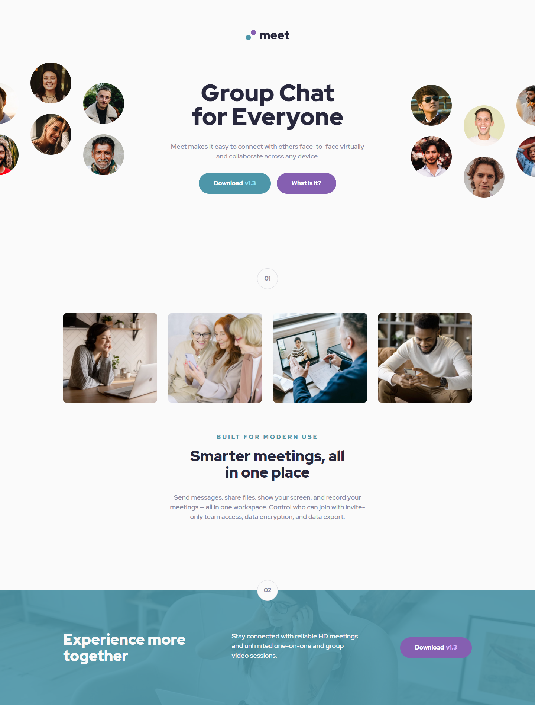

# Frontend Mentor - Meet landing page solution

This is a solution to the [Meet landing page challenge on Frontend Mentor](https://www.frontendmentor.io/challenges/meet-landing-page-rbTDS6OUR). Frontend Mentor challenges help you improve your coding skills by building realistic projects.

## Table of contents

- [Overview](#overview)
  - [The challenge](#the-challenge)
  - [Screenshot](#screenshot)
  - [Links](#links)
- [My process](#my-process)
  - [Built with](#built-with)
  - [What I learned](#what-i-learned)
- [Author](#author)

## Overview

### The challenge

Users should be able to:

- View the optimal layout depending on their device's screen size
- See hover states for interactive elements

### Screenshot

### Links

- Solution URL: (https://www.frontendmentor.io/solutions/responsive-landing-page-with-grid-css-vars-cImP4dY0_)
- Live Site URL: (https://lm-meet-landing-page.netlify.app/)

## My process

### Built with

- Semantic HTML5 markup
- CSS custom properties/vars
- Desktop-first workflow

### What I learned

First thing I learnt or paid more attention to get better at was adding in the styles and util classes at the start.

I was given a style guide, so I carefully defined colour names vars, and then added variables for each typography element, it's font size, weight, line-height and letter spacing (didn't include colour as this changes with context, better to change at component level).

I made sure to change any properties that needed changing at tablet and mobile view with media queries. I then gave h1 and h2 elements their styles, however with the other text I opted for utility classes, as I can't say for sure they will be only 
 or only this or that, making it more flexible.

## Author

- Website - [Leon Michalak](https://www.leonmichalak.tech)
- Frontend Mentor - [@NinjaInShade](https://www.frontendmentor.io/profile/NinjaInShade)
- Instagram - [@lmdeveloper](https://www.instagram.com/lmdeveloper/)
